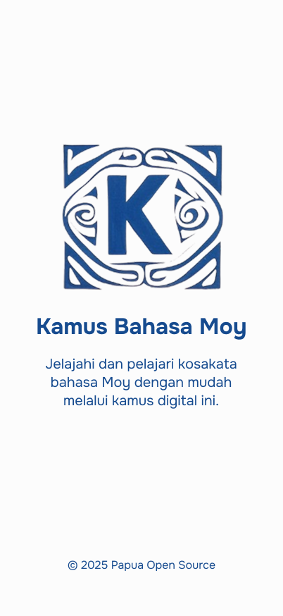
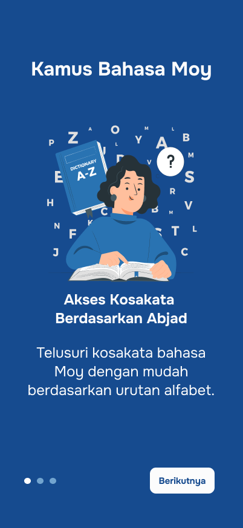
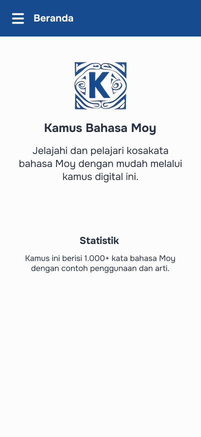

<h1 align="center">Kamus Bahasa Moy</h1>

  
  <h3>Aplikasi Kamus Digital untuk Pelestarian Bahasa Moy</h3>

## 📝 Deskripsi

Kamus Bahasa Moy adalah aplikasi mobile yang dikembangkan untuk membantu melestarikan dan mempromosikan bahasa Moy dari Jayapura, Papua. Aplikasi ini menyediakan kosakata bahasa Moy beserta terjemahan, pengucapan, dan contoh penggunaan dalam kalimat. Dengan antarmuka yang intuitif dan fitur-fitur yang berguna, aplikasi ini memudahkan pengguna untuk mempelajari dan mengapresiasi bahasa Moy.

**Data bahasa dalam aplikasi ini diambil dari Kamus Dwibahasa Mooi yang dibuat oleh Balai Bahasa Provinsi Papua**, sehingga menjamin keakuratan dan keaslian konten bahasa yang disajikan.

## ✨ Fitur Utama

- **Kamus Komprehensif**: Berisi lebih dari 2.500+ kata bahasa Moy dengan arti, pengucapan, dan kelas kata
- **Penelusuran Abjad**: Cari kata berdasarkan abjad dengan navigasi yang mudah
- **Contoh Kalimat**: Setiap kata dilengkapi dengan contoh penggunaan dalam kalimat bahasa Moy dan terjemahan Bahasa Indonesia
- **Klasifikasi Kelas Kata**: Identifikasi jenis kata (nomina, verba, adjektiva, dll)
- **Tampilan Responsif**: Desain yang nyaman digunakan pada berbagai ukuran layar

## 🛠️ Teknologi yang Digunakan

- **Framework**: Flutter (Dart)

## 📱 Screenshot

  <table>
    <tr>
      <td></td>
      <td></td>
      <td></td>
    </tr>
    <tr>
      <td></td>
      <td></td>
      <td></td>
    </tr>
  </table>

## 🤝 Kontribusi

Kontribusi untuk pengembangan Kamus Bahasa Moy sangat diapresiasi. Jika Anda ingin berkontribusi, Silahkan baca panduannya [disini](CONTRIBUTING.md).

## 📄 Lisensi

Proyek ini dilisensikan di bawah lisensi AGPL-3.0 - lihat file [LICENSE](LICENSE) untuk detailnya.

## 🙏 Kredit

- Dikembangkan oleh Papua Open Source
- UI/UX Design oleh Tim Papua Open Source, dengan beberapa aset visual lainnya yang berasal dari berbagai sumber
- Logo dibuat menggunakan Grok AI
- Data kosakata berasal dari Kamus Dwibahasa Mooi yang disusun oleh Balai Bahasa Provinsi Papua

## 📖 Sumber Data

Aplikasi ini menggunakan data kosakata dan definisi dari **Kamus Dwibahasa Mooi** yang diterbitkan oleh **Balai Bahasa Provinsi Papua**. Kamus tersebut merupakan sumber otoritatif untuk bahasa Moy/Mooi dan telah disusun melalui penelitian bahasa yang ekstensif oleh ahli linguistik dari Balai Bahasa.

Penggunaan data dari sumber resmi ini memastikan bahwa pengguna mendapatkan informasi bahasa yang akurat dan otentik, sejalan dengan upaya pelestarian bahasa daerah di Papua.

## 🔄 Adaptasi untuk Bahasa Daerah Lain

Kode sumber Kamus Bahasa Moy dapat Anda gunakan untuk membuat aplikasi kamus untuk bahasa daerah lainnya di Indonesia atau di seluruh dunia. Kami mendorong upaya pelestarian bahasa daerah melalui teknologi dan dengan senang hati menyediakan codebase ini sebagai dasar pengembangan aplikasi serupa.

Dalam mengadaptasi kode sumber ini, Anda wajib:
- Tetap mencantumkan atribusi kepada Papua Open Source sebagai pengembang awal
- Mematuhi ketentuan lisensi AGPL-3.0, termasuk menjaga kode sumber tetap terbuka untuk umum

## 📬 Kontak

Untuk pertanyaan atau masukan, silakan hubungi kami di:
- Email: contact@papuaopensource.org
- Website: www.papuaopensource.org